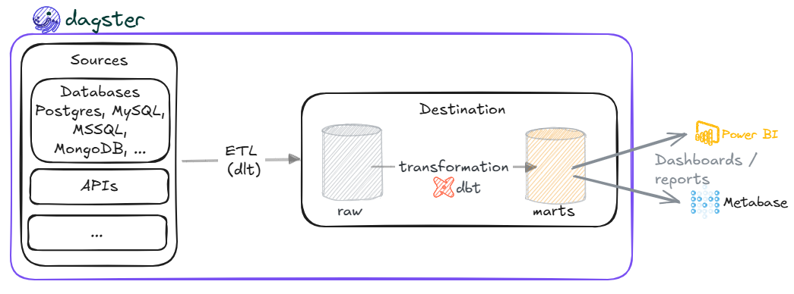
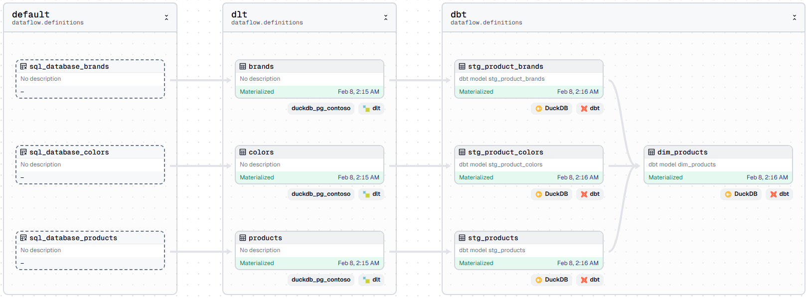
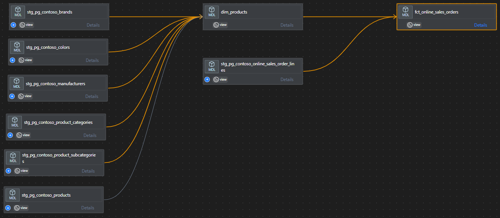

# The DDD Data Pipelines

As in software development, where the DDD approach is used, I wanted to design a data pipeline with the same name—The DDD Data Pipeline—where each **`D`** represents a framework that contributes to the final project.



The DDD Data Pipelines leverage these frameworks:
- [**dlt**](https://dlthub.com/): for Extract/Load (EL) in ETL workflows.
- [**dbt**](https://www.getdbt.com/): for data transformation using SQL.
- [**Dagster**](https://dagster.io/): for orchestration.
- Other `D`s
  - [**DuckDB**](https://duckdb.org/): an in-memory OLAP/analytics database.
  - **Docker**: for containerization.

<!-- TOC -->

- [The DDD Data Pipelines](#the-ddd-data-pipelines)
  - [Summary](#summary)
    - [استخدام data load tool (dlt) لعمليات Extract \& Load](#استخدام-data-load-tool-dlt-لعمليات-extract--load)
    - [التأكد من صحة إعدادات YAML باستخدام Pydantic](#التأكد-من-صحة-إعدادات-yaml-باستخدام-pydantic)
    - [معالجة البيانات بعد تحميلها (Transformations) باستخدام dbt](#معالجة-البيانات-بعد-تحميلها-transformations-باستخدام-dbt)
    - [جدولة وتنفيذ ال data pipeline باستخدام Dagster](#جدولة-وتنفيذ-ال-data-pipeline-باستخدام-dagster)
  - [Videos](#videos)

<!-- /TOC -->

---



## Summary

**بإذن الله في هذا المشروع التعليمي سنقوم بتنفيذ كل شيء على الجهاز الشخصي (locally) دون الاعتماد على خدمات أونلاين. لاحقًا، قد ننتقل من DuckDB إلى Google BigQuery.**

### استخدام data load tool (dlt) لعمليات Extract & Load
- سنتعلم كيفية استخدام **dlt** لاستخراج وتحميل البيانات من قاعدة بيانات **Postgres** إلى **DuckDB**.
  - توفر **dlt** إمكانية التعامل مع مصادر بيانات متنوعة، مثل قواعد البيانات والخدمات (Facebook Ads / Google Analytics / HubSpot / Zendesk)، ونقل البيانات إلى وجهات مختلفة مثل **Google BigQuery / Redshift / Snowflake**.
- سنستعرض عدة مواضيع، منها:
  - طرق تسجيل البيانات التي تم سحبها extracted في ال destination باستخدام اساليب مختلفة مثل append / merge / replace
  - استخدام ال incremental mode لسحب البيانات الجديدة new records أو التي تم تحديثها updated
  - الإعتماد على ملفات YAML لتسجيل الإعدادات الخاصة بمصدر البيانات من
    - تحديد اسماء الجداول tables التي يتم سحبها
    - ايقاف/تشغيل جدول معين حسب الحاجة
    - اسلوب تسجيل البيانات
    - إعدادات ال incremental load
    - ...
    ```yaml
    - name: brands
      write_disposition: merge
      primary_key:
        - brand_id
      incremental:
        cursor_path: updated_at
        initial_value: "1900-01-01T00:00:00Z"
        row_order: asc
    - name: categories
      write_disposition: replace
      primary_key:
        - category_id
    ```
  - ❓ لماذا اخترت ملفات YAML بدلا من ملفات TOML (المدعوم افتراضيا من dlt)؟ ببساطة لم استطع التأقلم معها.
  - هل نستطيع أن نتحكم في أي الأعمدة نقوم بسحبها؟ أم أننا مضطرون لسحب كل الأعمدة
    ```sql
    SELECT * FROM table_name
    ```
### التأكد من صحة إعدادات YAML باستخدام [Pydantic](https://docs.pydantic.dev/latest/)
- نظرًا لاعتمادنا على ملفات YAML في تنظيم الإعدادات، من المهم ضمان الالتزام بهيكل واضح (schema).
- سنتعرف على كيفية استخدام Pydantic لإجراء عمليات التحقق (validations)، مثل:
  - ال data types لكل بند
  - ما هي البنود ذات القيم الإلزامية؟
  - ال field validation
  - ال model validation

### معالجة البيانات بعد تحميلها (Transformations) باستخدام dbt

- بعد تنفيذ عمليات Extract & Load باستخدام dlt، ستكون البيانات في شكلها الخام (raw).
- الخطوة التالية هي إجراء عمليات المعالجة المختلفة Transformations باستخدام dbt لجعل البيانات جاهزة للتحليل.
- خلال استخدامنا ل data build tool (**dbt**) سنتطرق لهذه النقاط
  - إضافة dbt للمشروع والإعتماد على قاعدة البيانات DuckDB
    - لاحقاً، **قد** نستعرض بشكل سريع كيفية الإنتقال من DuckDB الى Google BigQuery
  - ربط integrate البيانات في DuckDB مع dbt من خلال ملفات profiles.yml & sources.yml
  - تنظيم مشروع dbt بشكل يتماشى مع [الإرشادات العامة من شركة dbt](https://docs.getdbt.com/best-practices/how-we-structure/1-guide-overview) (تعلمت طريقة تنظيم المشروع من م/محمد حسين، واطلعت على الإرشادات في وقت لاحق، شكرا يا محمد 🙌)
  - كيفية التحكم في ال schema/dataset التي سيتم اضافة مخرجات dbt اليها
### جدولة وتنفيذ ال data pipeline باستخدام Dagster
- بعد اجراء عمليات ال Extract & Load باستخدام **dlt** وعمليات المعالجة Transformations باستخدام **dbt**، نحتاج الى وسيلة لجدولة scheduling هذه العمليات المختلفة بترتيب واضح
- هنا سنتجه الى Dagster لتنفيذ عملية ال orchestration، خلال إستخدامنا ل Dagster سنتعرف على النقاط التالية
  - إجراء عملية الربط integration بين dagster & dlt
  - إجراء عملية الربط integration بين dagster & dbt
  - ضمان وجود ترابط صحيح بين مخرجات كلا من dlt & dbt داخل بيئة dagster من خلال ال Translators
  - بناء dagster jobs & schedules لتنفيذ ال data pipeline بداية من سحب البيانات وتخزينها باستخدام dlt ثم عمليات المعالجة باستخدام dbt

## Videos
1. (Helper) Loading the Postgres source database from Parquet files.
2. Builidng a PoC for the DDD data pipeline
   
