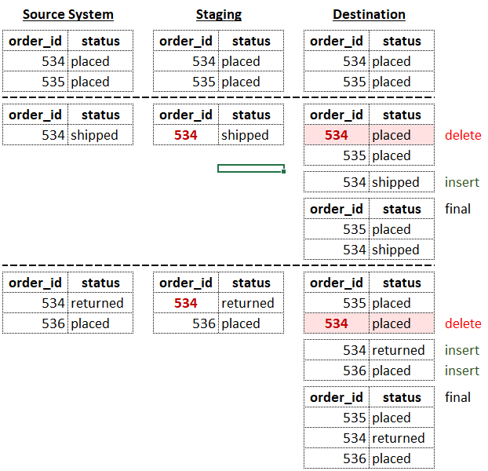
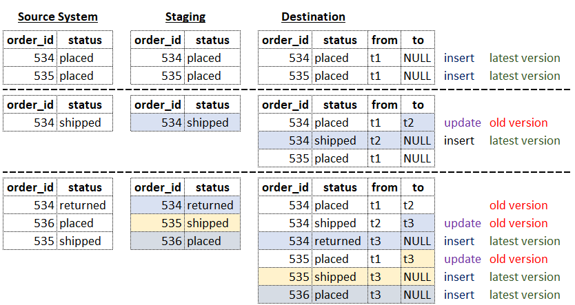

# dlthub Write Disposition

- [Official documentation](https://dlthub.com/docs/general-usage/incremental-loading#choosing-a-write-disposition)

- Replace / Full loading
  - `truncate-and-insert` Strategy (default replace strategy)
  - `insert-from-staging` Strategy
  - `staging-optimized` Strategy
- Append
- MERGE
  - `delete-insert` Strategy (default merge strategy)
  - `upsert` Strategy
  - `scd2` Strategy

---

- Each dlt destination can support all/some of these modes/strategies
  - destinations:
    - filesystem: doesn't support `merge`
    - duckdb: supports `merge`, but only `delete-insert` and `scd2`
  - Check the destination documentation and/or its **source code**.
- The `replace` mode will reset the dlt resource state (`state.json`), thus, if the resource has any **incremental** configuration, the pipeline run will do a **full load**.
- In the `merge` mode, extracted is always loaded to the staging dataset first.
- We can check the queries generated by dlt from `destinations\sql_jobs.py`, and find `job._save_text_file`
- merge / `delete-insert`

  

  ```py
  colors.apply_hints(
      write_disposition="merge",
      primary_key=["id", "color_name"],
  )
  pipeline = dlt.pipeline(
     pipeline_name="wd_merge",
     destination="duckdb",
     dataset_name="wd_demo",
  )
  ```
  ```sql
  DELETE FROM "wd_demo"."colors" as d
  WHERE EXISTS (
      SELECT 1 FROM "wd_demo_staging"."colors" as s
      WHERE
          d."id" = s."id"
          AND d."color_name" = s."color_name"
          -- using `merge_key` will add `OR` conditions here
  );
  INSERT INTO "wd_demo"."colors" (...)
  SELECT ...
  FROM (
      SELECT
          ROW_NUMBER() OVER (
              -- using `merge_key` doesn't affect this part, it only uses `primary_key`
              partition BY "id", "color_name"
              ORDER BY (SELECT NULL)
          ) AS _dlt_dedup_rn,
          ...
      FROM "wd_demo_staging"."colors"
  ) AS _dlt_dedup_numbered
  WHERE
      _dlt_dedup_rn = 1
      AND (1 = 1)
  ```
- merge / `scd2`

  

  ```py
  colors = source.resources.get("colors")
  colors.apply_hints(
      write_disposition={"disposition": "merge", "strategy": "scd2"},
      merge_key=["id"],
  )
  ```
  ```sql
  UPDATE "wd_demo"."colors"
  SET "_dlt_valid_to" = '2025-02-28 22:07:54.295992+00:00' -- ⛔ same value as in next valid_from
  --                     ^^^^^^^^^^^^^^^^^^^^^^^^^^^^^^^^
  WHERE
      "_dlt_valid_to" IS NULL
      AND "_dlt_id" NOT IN ( SELECT "_dlt_id" FROM "wd_demo_staging"."colors")
      AND "id"          IN ( SELECT "id"      FROM "wd_demo_staging"."colors")
  ;

  INSERT INTO "wd_demo"."colors" (..., "_dlt_valid_from", "_dlt_valid_to")
  SELECT
      ...,
      '2025-02-28 22:07:54.295992+00:00' AS "_dlt_valid_from", -- ⛔ same value as previous valid_to
  --   ^^^^^^^^^^^^^^^^^^^^^^^^^^^^^^^^
      NULL AS "_dlt_valid_to"
  FROM "wd_demo_staging"."colors" AS s
  WHERE "_dlt_id" NOT IN (
      SELECT "_dlt_id"
      FROM "wd_demo"."colors"
      WHERE "_dlt_valid_to" IS NULL
  );
  ```
